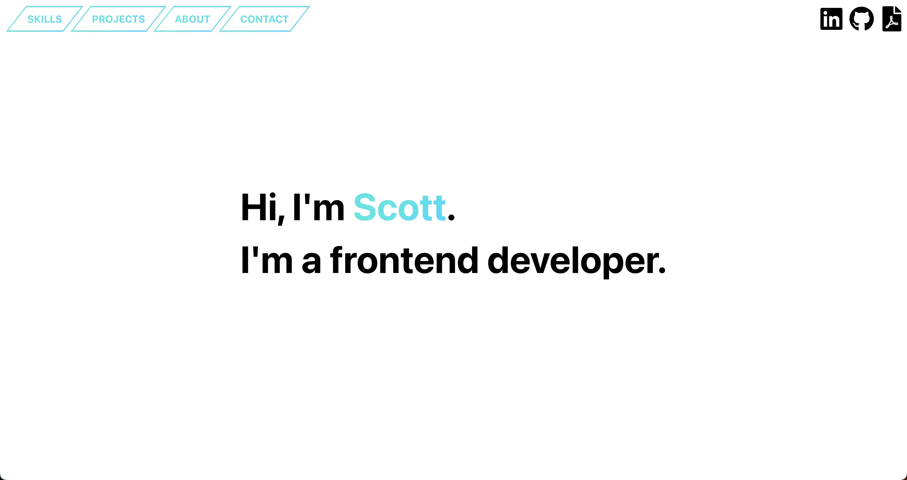
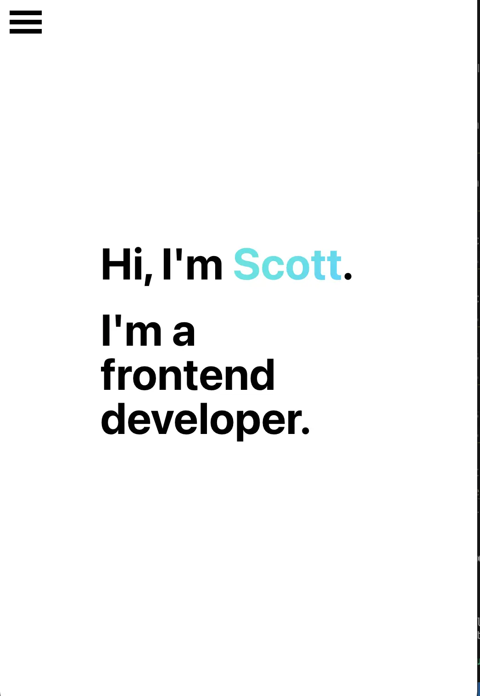
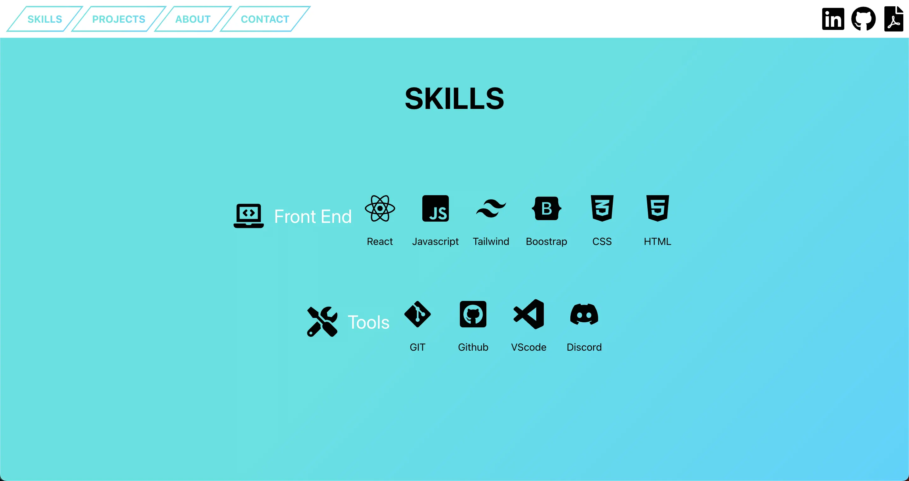
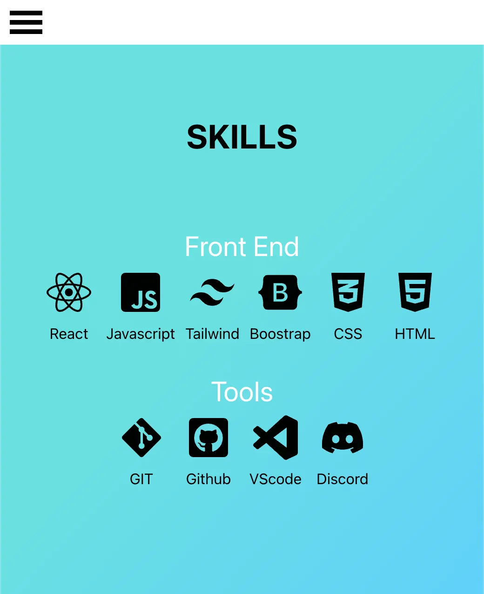
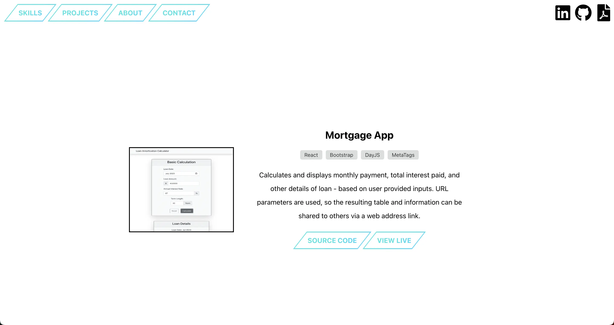
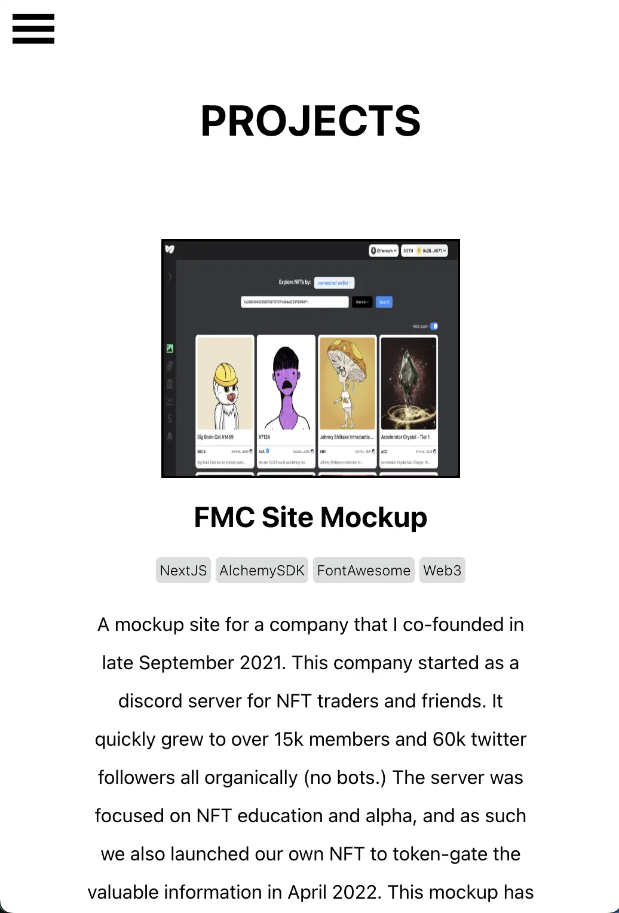
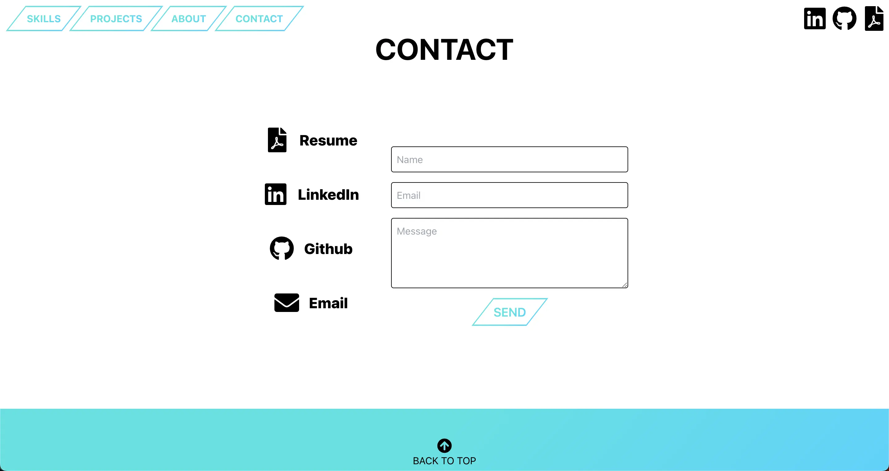
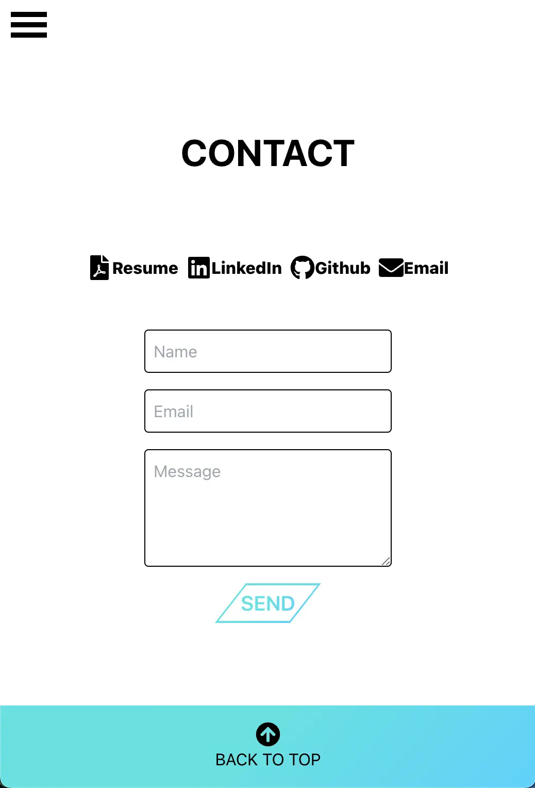

# scottxbrown.com - Portfolio Site

[view here](https://www.scottxbrown.com)

Website to house my current portfolio and resume. Contact information available, as well as links to social media profiles.

Built with: `React`, `React Animation-On-Scroll`, `Animate.css`, `EmailJS`, `React Icons`, and `Javascript`.

***

# Project Status

**Website containing the current portfolio, resume, and contact info of Scott Brown.** 
All projects listed have links to the usable live version and also the source code.

***

# Project Screen Shots

Landing page:

Landing page (MOBILE VIEW):

Skills section:

Skills section (MOBILE VIEW):

Projects section:

Projects section (MOBILE VIEW):

About section:

Contact section:

Contact section (MOBILE VIEW):

***

# Reflection

**This project is a portfolio site for myself.** Project goals included using technologies learned up until this point, gaining experience with a new CSS (Tailwind), and having a place to host my projects so they could be used/looked into for purposes of proving my abilities to recruiters/hiring managers. 

**I spent a week to prototype out the wesbite complete with UI design/color scheme/etc.** 
I started this process by using the `create-react-app` boilerplate, then adding `react-icons`, and `react-animation-on-scroll`. Then, I only worked on this sparingly as I was focusing my time on finishing my projects to put on this portfolio site.

A challenge I ran into early on was how to link the contact form to sending an email to my inbox. I researched adn found a solution in `emailJS` and was able to implement in a day.

I spent a couple days optimizing the text, links, and icons when I finished my [loan](https://www.loan.scottxbrown.com) project and added that to the projects section of the site.

Once I added another project to the list, I spent a week doing that, optimizing more code, and converting all my vanilla CSS to Tailwind.
I chose to use Tailwind as it was something new to me, and seemed to be gaining popularity in the industry. During this time I learned quite a bit about Tailwind and how to customize it further through it's `tailwind.config.js` file. 

During this time I also decided to tackle something else new for me, which was adding a pop-up modal when users submitted an email through the contact form - BUT with an overlay and stopped their ability to scroll.

**At the end of this period, I ended up with a site that has all information needed to contact me for any reason and a portfolio of work to view**

**The technologies implemented in this project are:**
- React
- React Animation-On-Scroll
- Tailwind
- EmailJS
- React Icons
- Javascript/JSX